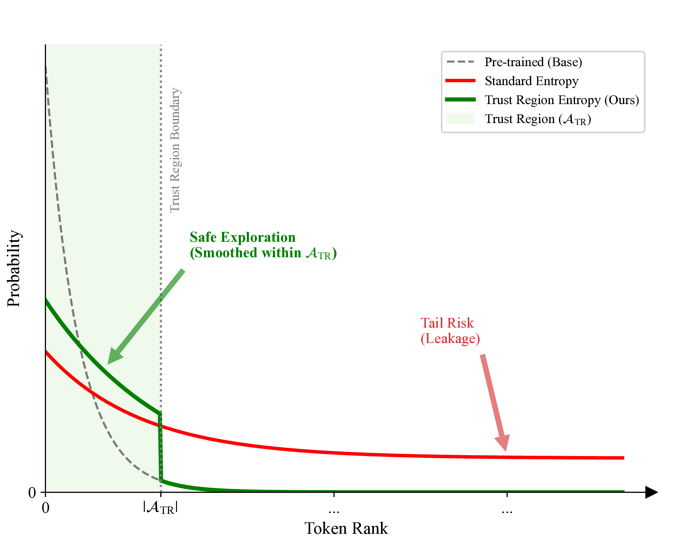

# Introduction

**Title:** TRE: Encouraging Exploration in the Trust Region

We propose **Trust Region Entropy (TRE)**, a novel exploration regularization technique for large language models (LLMs). Unlike standard entropy regularization—which indiscriminately spreads probability mass across the entire vocabulary and risks allocating mass to invalid tokens—TRE restricts exploration to a dynamically defined trust region of plausible tokens. This region can be constructed using either a fixed top-K (TRE-K) or a nucleus-based threshold (TRE-P).

As illustrated in Figure 1, TRE increases diversity only within the trust region, while maintaining suppression of the tail, thus improving both stability and generation quality. For more details, please refer to the algorithm and mathematical formulation in our paper.

<p align="center">
  
</p>

**Figure 1:** Overview of Trust Region Entropy (TRE). Standard entropy regularization (red) flattens the distribution and causes probability mass to leak into the tail. TRE (green) encourages diversity only within the trust region, avoiding tail risk.

# Environment Setup

Our code is based on [verl 0.4.x](https://github.com/verl-project/verl/tree/v0.4.x). Please follow the instructions in the original `README_verl.md` for environment installation.

# Training

## Math Task

```sh
# Prepare the dataset
python experiments/math/data_preprocess/math_dataset.py

# Note: Please specify the correct model path for both actor and critic.
# Vanilla PPO and Entropy (by modifying ENTROPY_COEFF)
bash experiments/math/1.5b_ppo.sh
bash experiments/math/7b_ppo.sh

# Forking-Tokens baseline
bash experiments/math/1.5b_ppo_forking_tokens.sh
bash experiments/math/7b_ppo_forking_tokens.sh

# KL-Cov baseline
bash experiments/math/1.5b_ppo_kl_cov.sh
bash experiments/math/7b_ppo_kl_cov.sh

# TRE-K (ours)
bash experiments/math/1.5b_ppo_tre_k.sh
bash experiments/math/7b_ppo_kl_cov.sh

# TRE-P (ours)
bash experiments/math/1.5b_ppo_tre_p.sh
bash experiments/math/7b_ppo_tre_p.sh
```

## Countdown Task

```sh
# Prepare the dataset
python experiments/countdown/data_preprocess/countdown.py

# Note: Please specify the correct model path for both actor and critic.
# Vanilla PPO and Entropy (by modifying ENTROPY_COEFF)
bash experiments/countdown/1.5b_ppo.sh
bash experiments/countdown/7b_ppo.sh

# Forking-Tokens baseline
bash experiments/countdown/1.5b_ppo_forking_tokens.sh
bash experiments/countdown/7b_ppo_forking_tokens.sh

# KL-Cov baseline
bash experiments/countdown/1.5b_ppo_kl_cov.sh
bash experiments/countdown/7b_ppo_kl_cov.sh

# TRE-K (ours)
bash experiments/countdown/1.5b_ppo_tre_k.sh
bash experiments/countdown/7b_ppo_tre_k.sh

# TRE-P (ours)
bash experiments/countdown/1.5b_ppo_tre_p.sh
bash experiments/countdown/7b_ppo_tre_p.sh
```

## HH Task

```sh
# Reward model preparation
# Use trl to train a scalar reward model (see: https://huggingface.co/docs/trl/main/en/reward_trainer)
# Environment setup
pip install uv
uv pip install trl

# 1.5B training
accelerate config
accelerate launch --multi_gpu --num_processes=8 experiments/hh/reward/train_reward_model_1.5b.py

# 7B training
pip install deepspeed
accelerate launch --config_file experiments/hh/reward/deepspeed_config_zero3.yaml experiments/hh/reward/train_reward_model_7b.py

# Start reward model server (set HH_REWARD_MODEL_PATH accordingly)
bash experiments/hh/reward/run_with_server.sh

# Test reward model
export NO_PROXY=localhost,127.0.0.1,0.0.0.0,::1,$NO_PROXY
export REWARD_SERVER_URL="http://localhost:8888/predict"
python experiments/hh/reward/test_reward_server.py

# Prepare the dataset
python experiments/hh/data_preprocess/hh.py

# Note: Please specify the correct model path for both actor and critic.
# Vanilla PPO and Entropy (by modifying ENTROPY_COEFF)
bash experiments/hh/1.5b_ppo.sh
bash experiments/hh/7b_ppo.sh

# Forking-Tokens baseline
bash experiments/hh/1.5b_ppo_forking_tokens.sh
bash experiments/hh/7b_ppo_forking_tokens.sh

# KL-Cov baseline
bash experiments/hh/1.5b_ppo_kl_cov.sh
bash experiments/hh/7b_ppo_kl_cov.sh

# TRE-K (ours)
bash experiments/hh/1.5b_ppo_tre_k.sh
bash experiments/countdown/7b_ppo_tre_k.sh

# TRE-P (ours)
bash experiments/hh/1.5b_ppo_tre_p.sh
bash experiments/hh/7b_ppo_tre_p.sh
```

# Implementation Details

- **KL-COV baseline:** See `verl/trainer/ppo/core_algos.py` line 519
- **Forking Tokens baseline:** See `verl/trainer/ppo/core_algos.py` line 706
- **TRE (ours):** See `verl/utils/torch_functional.py` line 125

